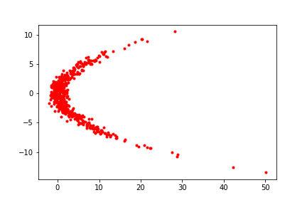
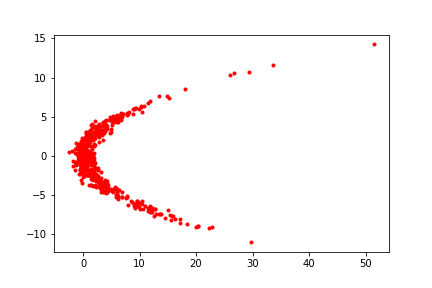

# Masked Autoregressive Flow 

## The model

We will use the `AutoRegressiveNN` and `InverseAutoregressiveFlowStable` implemented in pyro.

```{.python .input}
import torch
import torch.nn as nn
import torch.nn.functional as F
import pyro.distributions as dist
from pyro.distributions import InverseAutoregressiveFlowStable
from pyro.nn import AutoRegressiveNN

import matplotlib.pyplot as plt
%matplotlib inline

device = torch.device("cuda" if torch.cuda.is_available() else "cpu")
```

We can define an iaf instance with the following code

`iaf = InverseAutoregressiveFlowStable(AutoRegressiveNN(2, [4]))`

and get `maf` with `maf = iaf.inv`

As the learnable parameters are stored in `iaf.module` so we still pass the `iafs` into the defined `MAFsDensityEstimator`.

We can get the transformed distribution with a base distribution and masked autoencoder normalizing flows

```{.python .input}
dist.TransformedDistribution(
    dist.MultivariateNormal(μ, σ),
    mafs
)
```

```{.python .input}
class MAFsDensityEstimator(nn.Module):
    def __init__(self, D, iafs):
        super(MAFsDensityEstimator, self).__init__()
        self.iafs = iafs
        self.iafs_modules = nn.ModuleList([iaf.module for iaf in self.iafs])
        ## inversing IAF to get MAF
        mafs = [iaf.inv for iaf in self.iafs]
        μ, σ = torch.zeros(D, device=device), torch.eye(D, device=device)
        self.d = dist.TransformedDistribution(
            dist.MultivariateNormal(μ, σ),
            mafs
        )
    def forward(self, x):
        return self.d.log_prob(x)

    def sample(self, n):
        return self.d.sample((n,))
```

Let us define a target distribution to be learned.

```{.python .input  n=28}
## draw samples from target distribution
def drawP(n):
    x2_dist = dist.Normal(0, 4)
    x2 = x2_dist.sample((n,))
    x1_dist = dist.Normal(.25 * x2.pow(2), torch.ones_like(x2))
    x1 = x1_dist.sample()
    x = torch.stack([x1, x2], dim=1)
    return x
```

Drawing the training data and defining the model.

```{.python .input  n=22}
x = drawP(512).to(device)

K, D = 2, 2
mafs = [InverseAutoregressiveFlowStable(AutoRegressiveNN(2, [4])) for _ in range(K)]
m = MAFsDensityEstimator(D, mafs).to(device)
optimizer = torch.optim.Adam(m.parameters(), lr=0.001)
lossF = lambda x: -torch.mean(m(x))
```

Training.

```{.python .input  n=9}
epochs, iterations = 5, 5000
for epoch in range(epochs):
    epochLoss = 0.0
    for i in range(iterations):
        loss = lossF(x)
        epochLoss += loss.item()

        optimizer.zero_grad()
        loss.backward()
        optimizer.step()
    print("Epoch: {}  Loss: {}".format(epoch, epochLoss/iterations))
```

## Visualization 

### The learned distribution

```{.python .input  n=11}
z = m.sample(512)
plt.plot(z.cpu().numpy()[:, 0], z.cpu().numpy()[:, 1], ".r")
plt.savefig("images/iaf-1.png")
```



### The target distribution

```{.python .input}
plt.plot(x.cpu().numpy()[:, 0], x.cpu().numpy()[:, 1], ".r")
plt.savefig("images/iaf-2.png")
```



```{.python .input}

```
