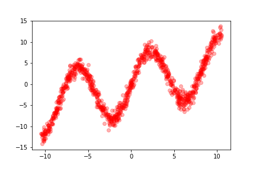
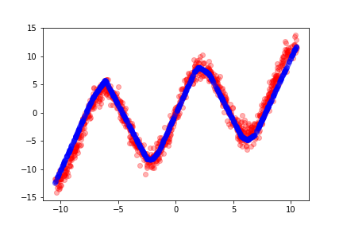
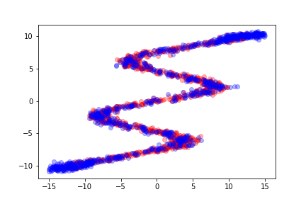
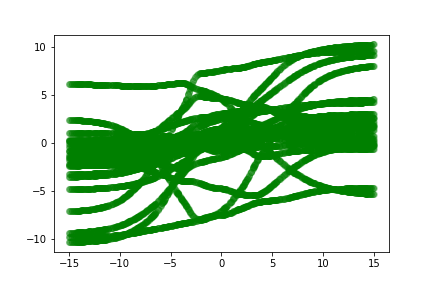
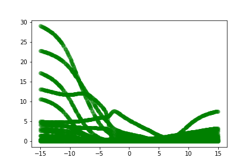
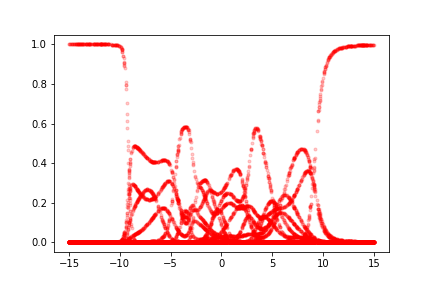

# Mixture Density Net

```{.python .input}

```

```{.python .input  n=1}
import torch
import torch.nn as nn
import torch.nn.functional as F
import torch.distributions as dist
import numpy as np
import matplotlib.pyplot as plt
%matplotlib inline
```

## $x \mapsto y$

Linear Regression

```{.python .input}
N = 1000

x = dist.Uniform(-10.5, 10.5).sample((N, 1))
ϵ = dist.Normal(0.0, 1.0).sample((N, 1))
y = torch.sin(0.75*x)*7.0 + 0.5*x + ϵ
plt.plot(x.cpu().numpy(), y.cpu().numpy(), 'ro', alpha=0.3)
```



```{.python .input  n=6}
batch, input_size, hidden_size, output_size = N, 1, 100, 1
model = nn.Sequential(
    nn.Linear(input_size, hidden_size),
    nn.ReLU(),
    nn.Linear(hidden_size, output_size)
)
criterion = nn.MSELoss()
```

```{.python .input}
## optimizing with first order method
optimizer = torch.optim.RMSprop(model.parameters(), lr=0.01, alpha=0.8)
for i in range(20000):
    output = model(x)
    loss = criterion(output, y)
    if i % 1000 == 0: print(loss.item())
    optimizer.zero_grad()
    loss.backward()
    optimizer.step()
```

```{.python .input}
## test
with torch.no_grad():
    x_test = dist.Uniform(-10.5, 10.5).sample((N, 1))
    y_test = model(x_test)

plt.plot(x.cpu().numpy(), y.cpu().numpy(), "ro",
         x_test.cpu().numpy(), y_test.cpu().numpy(), "bo", alpha=.3)
```



## $y \mapsto x$

Mixture Density Net

```{.python .input  n=9}
N = 1000
y = dist.Uniform(-10.5, 10.5).sample((N, 1))
ϵ = dist.Normal(0.0, 1.0).sample((N, 1))
x = torch.sin(0.75*y)*7.0 + 0.5*y + ϵ
```

```{.python .input  n=10}
def logsumexp(x, dim=1):
    """
    Computing log sum exp along dim 1
    Input:
    x (N, ncomponent)
    Output:
    logsumexp (N, 1)
    """
    max_x, _ = x.max(dim=dim, keepdim=True)
    x = x - max_x
    return max_x + torch.log(torch.sum(torch.exp(x), dim=dim))

def logpdfGMM(log_π, μ, σ, x):
    """
    Input:
    π, μ, σ (N, ncomponent)
    x (N, 1)
    Output:
    logpdf (N, ncomponent)
    """
    log2pi = np.log(2) + np.log(np.pi)
    z = (x - μ) / σ
    exponents = log_π - 0.5*z*z - torch.log(σ) - 0.5*log2pi
    return logsumexp(exponents, dim=1)

batch, input_size, hidden_size, output_size = N, 1, 50, 1
ncomponent = 24
class MDN(nn.Module):
    """
    1-d Mixture Density Network
    """
    def __init__(self, input_size, hidden_size, ncomponent):
        super(MDN, self).__init__()
        self.linear = nn.Linear(input_size, hidden_size)
        self.f_log_π = nn.Sequential(
            nn.Linear(hidden_size, ncomponent),
            nn.LogSoftmax(dim=1)
        )
        self.f_μ = nn.Linear(hidden_size, ncomponent)
        self.f_log_σ = nn.Linear(hidden_size, ncomponent)

    def forward(self, input):
        """
        Input:
        input (batch, input_size): input[i] represents a point
        Output:
        log_π (batch, ncomponent)
        μ (batch, ncomponent)
        σ (batch, ncomponent)
        The three matrix define `batch` GMM distributions for the `batch` points
        in `input`
        """
        output = self.linear(input)
        #output = F.relu(output)
        output = F.tanh(output)
        return self.f_log_π(output),\
               self.f_μ(output),\
               torch.exp(torch.clamp(self.f_log_σ(output), min=-10, max=10))
```

```{.python .input  n=11}
model = MDN(input_size, hidden_size, ncomponent)
optimizer = torch.optim.RMSprop(model.parameters())
```

```{.python .input  n=12}
for i in range(10000):
    log_π, μ, σ = model(x)
    logpdf = logpdfGMM(log_π, μ, σ, y)
    loss = -torch.mean(logpdf)
    if i % 1000 == 0: print(loss.item())
    optimizer.zero_grad()
    loss.backward()
    optimizer.step()
```

```{.json .output n=12}
[
 {
  "name": "stdout",
  "output_type": "stream",
  "text": "6.295572757720947\n1.6086323261260986\n1.5020087957382202\n1.5111451148986816\n1.3701950311660767\n1.3653603792190552\n1.4414267539978027\n1.3033866882324219\n1.3943668603897095\n1.3255615234375\n"
 }
]
```

```{.python .input  n=13}
x_test = dist.Uniform(-15, 15).sample((N, 1))
with torch.no_grad():
    log_π, μ, σ = model(x_test)
    π = torch.exp(log_π)
    #π, μ, σ = π.cpu().numpy(), μ.cpu().numpy(), σ.cpu().numpy()
    ## Sampling n samples for each GMM distribution
    #samples = map(lambda x,y,z: drawGMM(x, y, z, 5), π, μ, σ)
    ## (N, n)
    #samples = np.stack(samples)
    idxs = dist.Categorical(π).sample((1,)).t()
    samples = dist.Normal(torch.gather(μ, 1, idxs), torch.gather(σ, 1, idxs)).sample()
    samples = samples.view(-1).cpu().numpy()
```

```{.python .input}
plt.plot(x.cpu().numpy(), y.cpu().numpy(),'ro',
         x_test.cpu().numpy(), samples, 'bo', alpha=0.3)
#plt.savefig("../images/mdn-3.png")
```



```{.python .input}
plt.plot(x_test.cpu().numpy(), μ.cpu().numpy(), "go", alpha=0.2)
#plt.savefig("../images/mdn-4.png")
```



```{.python .input}
plt.plot(x_test.cpu().numpy(), σ.cpu().numpy(), "go", alpha=0.2)
#plt.savefig("../images/mdn-5.png")
```



```{.python .input}
plt.plot(x_test.cpu().numpy(), π.cpu().numpy(), "r.", alpha=0.2)
#plt.savefig("../images/mdn-6.png")
```



```{.python .input}

```

```{.python .input}

```
